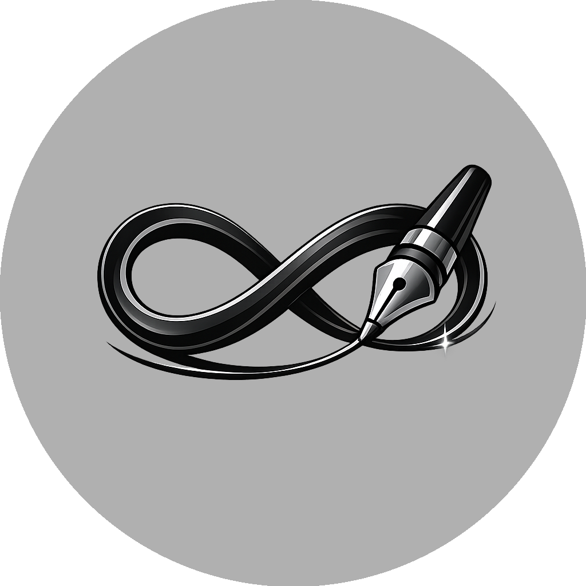
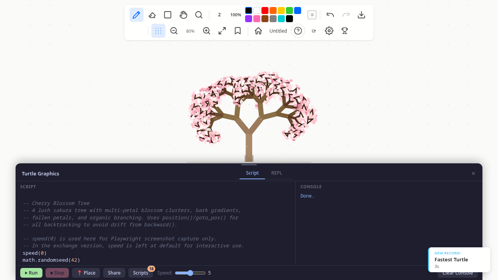
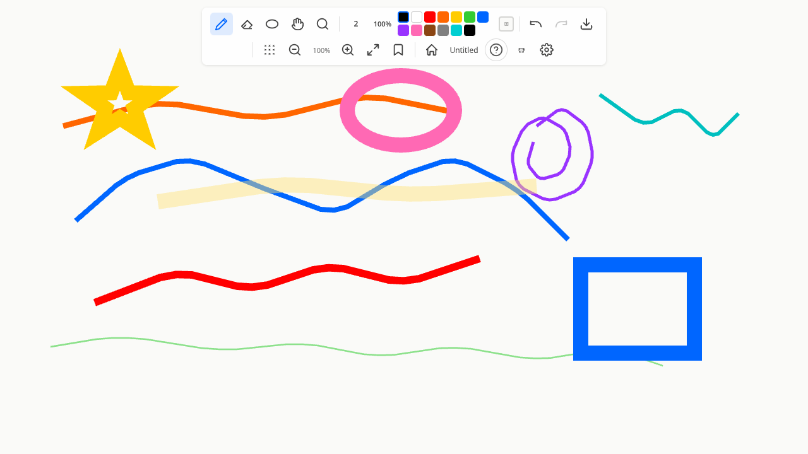
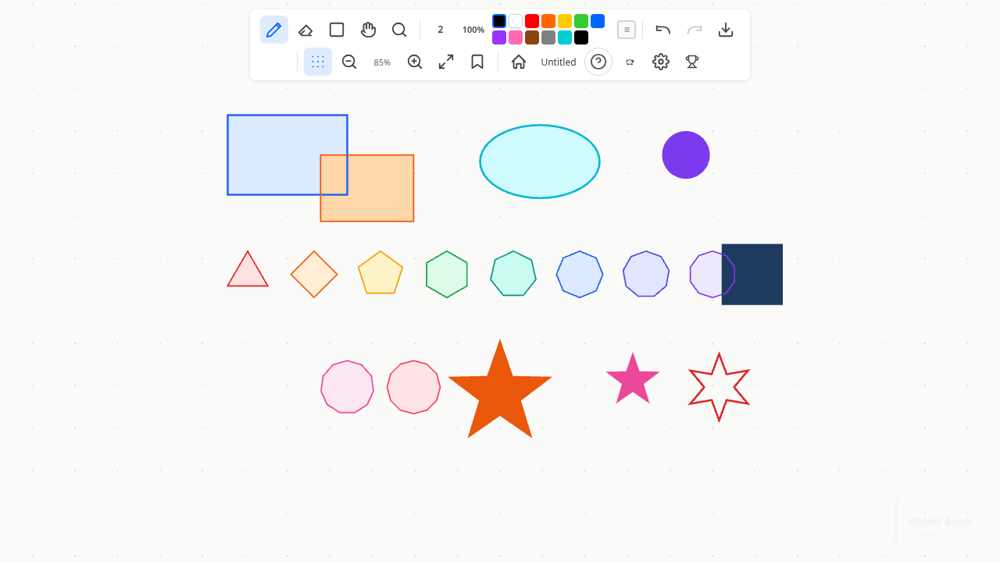
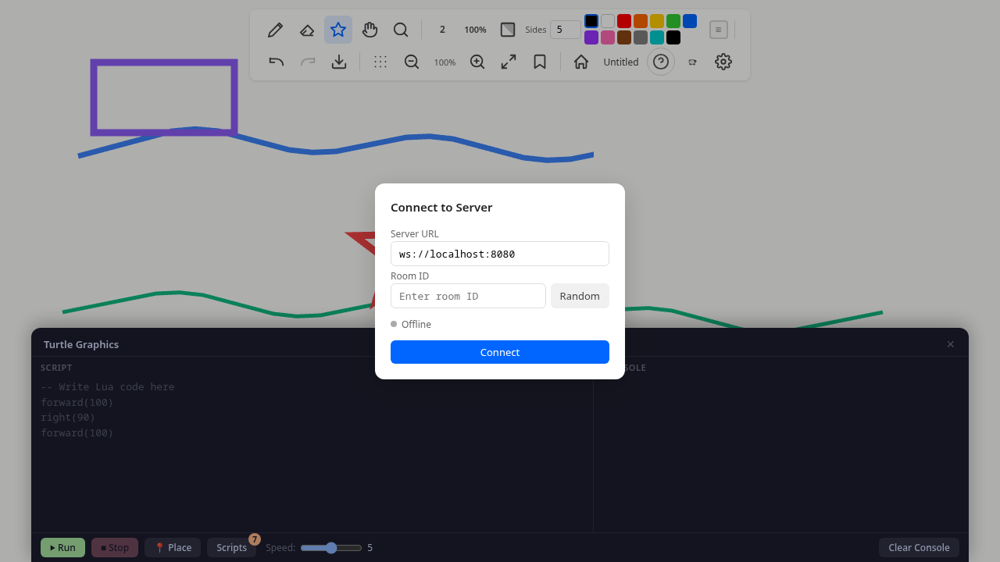
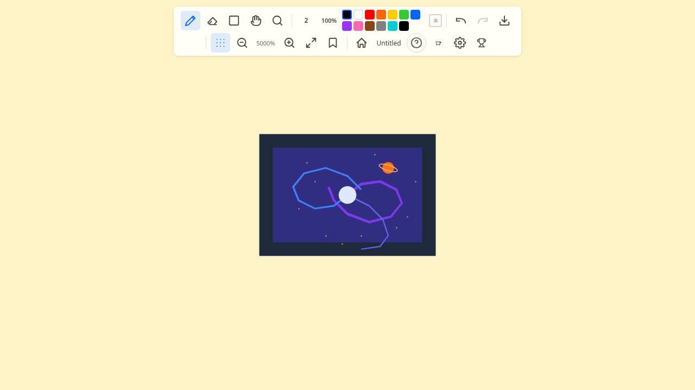
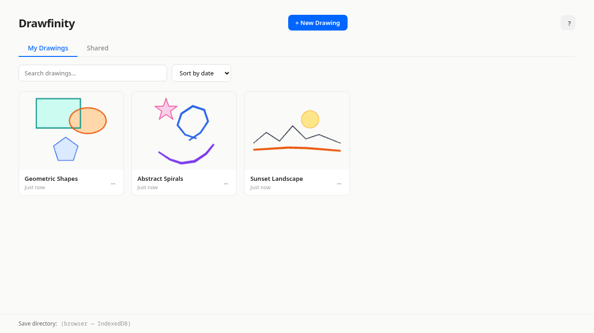

<p align="center">
  
</p>

<h1 align="center">Drawfinity</h1>

<p align="center"><em>An infinite canvas for drawing, collaboration, and creative coding.</em></p>

<p align="center">
  <a href="https://needmorecowbell.github.io/drawfinity/">Documentation</a> &middot;
  <a href="https://github.com/needmorecowbell/drawfinity/releases">Downloads</a> &middot;
  <a href="https://needmorecowbell.github.io/drawfinity/getting-started">Getting Started</a>
</p>

Drawfinity is a free, open-source drawing app with an infinite canvas. Use pressure-sensitive brushes to sketch, write Lua scripts to generate geometric art with turtle graphics, or draw together in real-time with friends. Runs as a native desktop app on Linux, macOS, and Windows.

<p align="center">
  
</p>

<p align="center">
  
</p>

## Features

### Highlights

- **Infinite canvas** — pan and zoom without limits, with momentum and smooth log-space zoom
- **Turtle graphics** — write Lua scripts to generate spirals, fractals, and geometric art
- **Real-time collaboration** — draw together in shared rooms with conflict-free sync
- **Cross-platform** — native desktop app on Linux, macOS, and Windows via Tauri v2

### Drawing Tools

Drawfinity comes with a **brush tool** offering four presets, an **eraser**, and four **shape tools** for quick geometry.

| Preset | Width | Pressure | Opacity | Use case |
|--------|-------|----------|---------|----------|
| **Pen** | 2px | Constant | Full | Technical drawing |
| **Pencil** | 1.5px | Responsive | Pressure-based | Sketching |
| **Marker** | 8px | Low sensitivity | Full | Bold strokes |
| **Highlighter** | 16px | Constant | 30% | Overlay marking |

**Shape tools:** Rectangle (`R`), Ellipse (`O`), Polygon (`P`), and Star (`S`). Each supports pressure-sensitive stroke width.

### Turtle Graphics

Open the turtle panel with `` Ctrl+` `` and write Lua scripts to drive a virtual turtle across the canvas. Built-in examples include spirals, fractal trees, and recursive snowflakes — a great way to explore creative coding.

```lua
-- Draw a square
for i = 1, 4 do
  forward(100)
  right(90)
end
```

See the [Turtle Graphics documentation](https://needmorecowbell.github.io/drawfinity/turtle-graphics) for the full API reference.

### Real-time Collaboration

Press `Ctrl+K` to open the connection panel, enter a server URL and room ID, and start drawing with others. All changes sync instantly and conflict-free via Yjs CRDTs — everyone can draw at the same time without issues.

### Camera & Navigation

- **Bookmarks** — save and recall camera positions (`Ctrl+B` to open panel, `Ctrl+D` to quick-add)
- **Momentum panning** — flick the canvas and it glides with inertia
- **Smooth zoom** — scroll wheel, trackpad pinch, or `Ctrl+=`/`Ctrl+-` with animation
- **Dot grid** — toggle a reference grid with `Ctrl+'`

### Home screen
Launch Drawfinity to the **Home Screen** — a drawing management hub with two tabs:
- **My Drawings** — create, rename, duplicate, and delete local drawings
- **Shared** — drawings from collaboration sessions

Press `Ctrl+W` or `Escape` from the canvas to return to the home screen.

### Gamification

Drawfinity tracks your drawing journey with badges, records, and statistics:

- **Badges** — 43 achievements across 4 tiers (Bronze, Silver, Gold, Platinum) in categories like drawing, turtle graphics, collaboration, and dedication
- **Personal records** — 13 tracked metrics (longest stroke, most strokes per canvas, etc.) with toast notifications when you beat your best
- **Statistics** — real-time metrics tracking your drawing sessions, tool usage, and more
- **Session summary** — end-of-session overlay showing what you accomplished

Open the stats panel with `Ctrl+Shift+S` to view your badges, records, and statistics.

## Screenshots

<table>
<tr>
<td align="center">
<br>
<em>Infinite canvas drawing</em>
</td>
<td align="center">
<br>
<em>Turtle graphics scripting</em>
</td>
</tr>
<tr>
<td align="center">
<br>
<em>Shape tools</em>
</td>
<td align="center">
<br>
<em>Real-time collaboration</em>
</td>
</tr>
<tr>
<td align="center">
<br>
<em>Infinite zoom — worlds within worlds</em>
</td>
<td align="center">
<br>
<em>Home screen</em>
</td>
</tr>
</table>

## Getting started

### Download a release (fastest)

Grab the latest release for your platform from the [GitHub Releases page](https://github.com/needmorecowbell/drawfinity/releases):

| Platform | Desktop App | Server |
|----------|-------------|--------|
| **Linux** | `.deb`, `.rpm`, `.AppImage` | `drawfinity-server-linux-amd64` |
| **macOS** | `.dmg` (Apple Silicon) | `drawfinity-server-macos-arm64` |
| **Windows** | `.msi`, `.exe` | `drawfinity-server-windows-amd64.exe` |

Download the desktop app, install it, and you're drawing in seconds. The server binary is optional — only needed if you want to host your own collaboration rooms.

See the [Downloads page](https://needmorecowbell.github.io/drawfinity/downloads) for detailed installation instructions per platform.

### Build from source

If you prefer to build from source, pick whichever path suits you:

#### Quick start with Docker

If you have Docker and Docker Compose, one command gets everything running — the collaboration server and the frontend:

```bash
make up
```

Open `http://localhost:1420` in your browser and start drawing. Use `make logs` to watch output, `make restart` to rebuild, and `make down` to stop.

#### Quick start without Docker

Start both the server and frontend locally:

```bash
make dev
```

This launches the collaboration server on port 8080 and Vite on port 1420. Stop everything with `make stop`.

#### Desktop app (from source)

For the full native experience with file save/load and tablet support:

```bash
make tauri
```

This starts Tauri in dev mode with hot-reload. For a production build: `npm run tauri build`.

| Platform | Format | Location |
|----------|--------|----------|
| Linux | `.deb`, `.rpm`, Binary | `src-tauri/target/release/bundle/` |
| macOS | `.dmg`, `.app` | `src-tauri/target/release/bundle/` |
| Windows | `.msi`, `.exe` | `src-tauri/target/release/bundle/` |

#### Browser only

If you just want to sketch without a server:

```bash
npm run dev
```

Open `http://localhost:1420`. Drawings are saved to localStorage (no collaboration in this mode).

<details>
<summary><strong>Prerequisites & platform dependencies</strong></summary>

- [Node.js](https://nodejs.org/) (v18+)
- [Rust](https://rustup.rs/) (stable toolchain) — needed for the collaboration server and Tauri desktop builds

**Linux (Debian/Ubuntu)**
```bash
sudo apt install libwebkit2gtk-4.1-dev libgtk-3-dev libayatana-appindicator3-dev librsvg2-dev
```

**Linux (Arch/Manjaro)**
```bash
sudo pacman -S webkit2gtk-4.1 gtk3 libayatana-appindicator librsvg
```

**macOS**
```bash
xcode-select --install
```

**Windows**
- [Visual Studio Build Tools](https://visualstudio.microsoft.com/visual-cpp-build-tools/) with the C++ workload
- [WebView2 runtime](https://developer.microsoft.com/en-us/microsoft-edge/webview2/) (pre-installed on Windows 10 1803+ and Windows 11)

</details>

### Makefile reference

Run `make help` to see all targets. Here's the full list organized by category:

| Category | Target | Description |
|----------|--------|-------------|
| **Docker** | `up` | Start server + frontend via Docker Compose |
| | `down` | Stop and remove containers |
| | `restart` | Restart everything |
| | `logs` | Tail logs from all services |
| | `logs-server` | Tail server logs only |
| | `logs-frontend` | Tail frontend logs only |
| **Local Dev** | `dev` | Start server + frontend locally (no Docker) |
| | `stop` | Stop local dev processes |
| | `server` | Start only the collaboration server |
| | `frontend` | Start only the frontend dev server |
| | `tauri` | Start Tauri desktop app in dev mode |
| **Testing** | `test` | Run all frontend tests |
| | `test-watch` | Run frontend tests in watch mode |
| | `test-server` | Run server tests |
| | `test-all` | Run all tests (frontend + server) |
| | `typecheck` | TypeScript type check |
| **Building** | `build` | Production build (frontend only) |
| | `build-tauri` | Production Tauri desktop build |
| | `build-server` | Production server build |
| | `build-all` | Build frontend + server |
| **Cleanup** | `clean` | Remove build artifacts |
| | `clean-docker` | Remove Docker containers, images, and volumes |
| | `clean-all` | Remove everything (build artifacts + Docker) |

## Running your own server

Drawfinity ships with a lightweight Rust collaboration server. It acts as a WebSocket relay — clients connect to a room, and the server broadcasts Yjs CRDT updates between them. Room state is persisted to disk so rooms survive server restarts.

### Standalone

```bash
make server
# or: cd server && cargo run
```

The server listens on port **8080** by default. Override with CLI flags or environment variables:

```bash
# CLI flags
cargo run -- --port 9090 --data-dir /path/to/storage

# Environment variables
DRAWFINITY_PORT=9090 DRAWFINITY_DATA_DIR=/path/to/storage cargo run
```

### Docker deployment

```bash
make up            # Docker Compose — starts server + frontend
# or
docker compose up
```

### Health check

```
GET http://localhost:8080/health
```

Returns `200 OK` when the server is ready. Useful for load-balancer probes or uptime monitors.

### Connecting from the app

1. Press `Ctrl+K` to open the connection panel
2. Enter the server URL (default: `ws://localhost:8080`)
3. Enter or generate a room ID
4. Click **Connect**

Multiple clients in the same room see each other's strokes in real time — all changes are conflict-free via Yjs CRDTs.

## Controls

### Drawing

| Input | Action |
|-------|--------|
| Left click + drag | Draw |
| `B` | Brush tool |
| `E` | Eraser tool |
| `R` | Rectangle shape tool |
| `O` | Ellipse shape tool |
| `P` | Polygon shape tool |
| `S` | Star shape tool |
| `1`–`4` | Select brush preset (Pen, Pencil, Marker, Highlighter) |
| `[` / `]` | Decrease / increase brush size |

### Navigation

| Input | Action |
|-------|--------|
| Middle mouse drag | Pan |
| `Space` + drag | Pan mode |
| `G` | Toggle pan/zoom tool |
| Scroll wheel | Zoom (discrete steps) |
| Trackpad pinch | Zoom (continuous) |
| `Ctrl+=` / `Ctrl+-` | Animated zoom in/out |
| `Ctrl+0` | Reset zoom to 100% |

### Panels & UI

| Input | Action |
|-------|--------|
| `Ctrl+K` | Toggle connection panel |
| `Ctrl+B` | Toggle bookmark panel |
| `Ctrl+D` | Quick-add bookmark |
| `Ctrl+,` | Toggle settings panel |
| `` Ctrl+` `` | Toggle turtle graphics panel |
| `Ctrl+'` | Toggle dot grid |
| `F3` | Toggle FPS counter |

### General

| Input | Action |
|-------|--------|
| `Ctrl+Z` / `Ctrl+Shift+Z` | Undo / Redo |
| `Ctrl+Shift+E` | Export PNG |
| `Ctrl+W` | Return to home screen |
| `Escape` | Return to home screen |

## Project structure

```
src/                     # TypeScript frontend
├── main.ts              # App entry point and render loop
├── camera/              # Infinite pan/zoom with momentum
├── canvas/              # CanvasApp — full drawing canvas lifecycle
├── crdt/                # Yjs CRDT document and undo manager
├── input/               # Pointer capture, stroke smoothing, shape capture
├── model/               # Stroke and document type definitions
├── persistence/         # Tauri file I/O and auto-save
├── renderer/            # WebGL2 rendering pipeline
├── sync/                # WebSocket collaboration (y-websocket)
├── tools/               # Brush presets, eraser, shape tools, tool manager
├── turtle/              # Lua turtle graphics runtime and drawing
├── ui/                  # Toolbar, connection panel, cursors, FPS
└── user/                # User preferences and profile

server/                  # Rust collaboration server
├── src/main.rs          # Axum HTTP + WebSocket server
├── src/room.rs          # Room management and broadcast
├── src/ws.rs            # WebSocket handler
└── src/persistence.rs   # Room state persistence

src-tauri/               # Tauri desktop wrapper configuration
```

## Development

### Run tests

```bash
make test               # All 716 tests (~5s)
make test-watch         # Watch mode
make test-server        # Server tests only
make test-all           # Frontend + server tests
```

### Type-check

```bash
make typecheck
```

### Clean build artifacts

```bash
make clean              # Remove build artifacts
make clean-docker       # Remove Docker containers, images, and volumes
make clean-all          # Remove everything (build artifacts + Docker)
```

See the [Makefile reference](#makefile-reference) for all available targets.

## Technology

- **Frontend:** TypeScript, Vite, WebGL2 (raw shaders, no framework)
- **Desktop:** Tauri v2 (Rust + WebKitGTK/WebView2)
- **Data sync:** Yjs CRDTs with y-websocket provider
- **Server:** Rust, Axum, Tokio
- **Rendering:** Triangle strip geometry, spatial indexing (grid-based), Douglas-Peucker LOD, vertex caching, batched draw calls
- **Persistence:** Binary Yjs state encoding via Tauri plugin-fs

## Stylus & Tablet Support

Pressure data is read from `PointerEvent.pressure` and works with:
- **Wacom tablets** on all platforms
- **Windows Ink** via WebView2
- Mouse input defaults to 0.5 pressure, so all brush presets work without a stylus

## Known Issues

- **AppImage builds** may fail on some Linux distributions — use `.deb`/`.rpm` packages or run the binary directly
- **WebKitGTK cache staleness** (Linux): if the UI shows stale content after code changes, run `npm run clean:cache`
- **macOS code signing**: unsigned builds work locally but require signing for distribution

See the [Cross-platform notes](https://needmorecowbell.github.io/drawfinity/cross-platform-notes) for detailed platform notes.

## Built with AI

Drawfinity is developed and managed with [Maestro](https://runmaestro.ai) orchestrating multiple [Claude Code](https://claude.com/claude-code) agents working in parallel. Maestro coordinates the planning, implementation, and review of features across the full stack — from the WebGL renderer to the Rust collaboration server.

## License

This project is licensed under the [MIT License](LICENSE).
