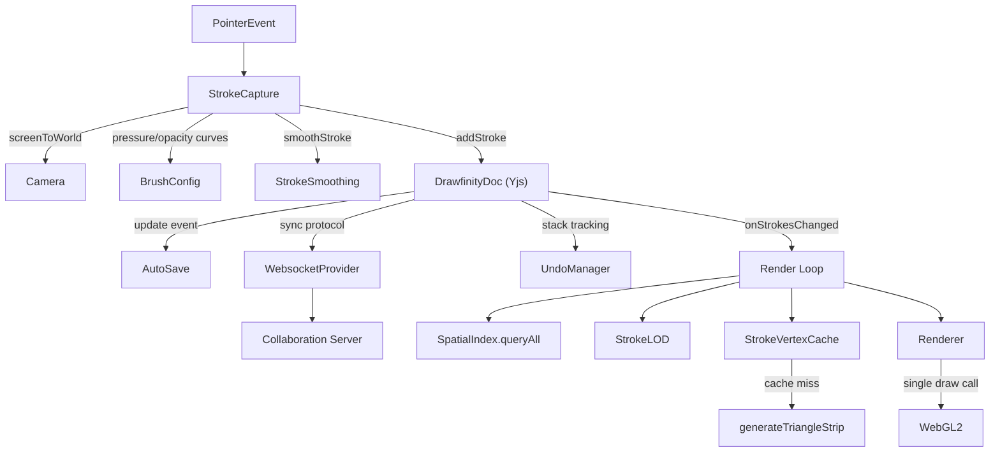
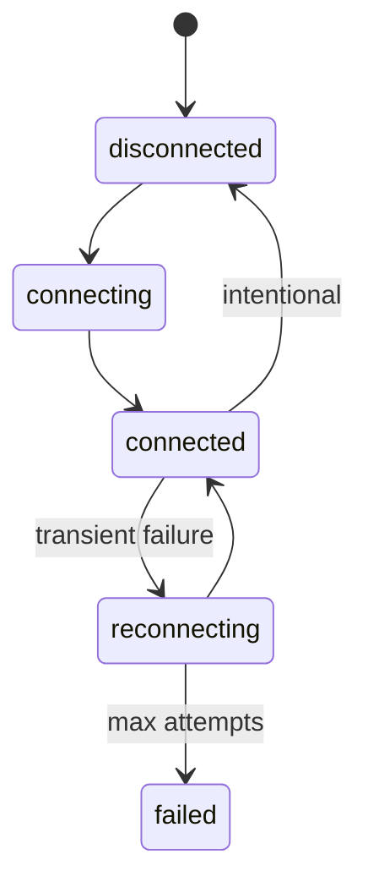

# Architecture

Drawfinity is built on a few interlocking systems: a WebGL2 rendering pipeline, a CRDT-backed data layer, a log-space camera, a pressure-aware input pipeline, and an optional collaboration server. This page explains how they fit together.

## System overview

## Rendering pipeline

### Triangle strip geometry

Drawfinity renders strokes as filled triangle strips rather than using the deprecated `GL_LINE_STRIP` with `gl.lineWidth()`. The geometry generator in `StrokeMesh.ts` converts each polyline into a flat `Float32Array` of interleaved vertex data (`x, y, r, g, b, a` per vertex).

For each point in a stroke, two vertices are emitted on opposite sides of the stroke direction, offset along the perpendicular normal. Interior points use **miter joins** — the normals of adjacent segments are averaged, and the miter vector is scaled by `1 / dot(miter, normal)` to maintain constant visual width at corners. The dot product is clamped at `0.1` to prevent spikes at sharp turns.

Pressure affects width per-point: `halfWidth = (baseWidth * pressure) / 2`. Single-point strokes produce a small quad instead.

### Batch rendering

All visible strokes are concatenated into a single `GL_TRIANGLE_STRIP` draw call. Between strips, **degenerate triangles** (zero-area) are inserted by repeating the last vertex of the previous strip and the first vertex of the next. This restarts the strip without ending the draw call, keeping the entire frame in one GPU submission.

Shape fills use the same batching pattern with `GL_TRIANGLES`.

### Spatial indexing

A uniform grid (`SpatialIndex.ts`, cell size 500 world units) maps each stroke's axis-aligned bounding box to every grid cell it overlaps. Viewport queries collect candidates from visible cells, deduplicate, AABB-test, and return items sorted by timestamp for correct painter's-order rendering.

Shapes and strokes are indexed separately but merged with a two-pointer sort for interleaved draw order.

### Level of detail

At low zoom levels, the Douglas-Peucker algorithm (`StrokeLOD.ts`) simplifies strokes to reduce vertex count:

| Max zoom | Tolerance (world units) |
|----------|------------------------|
| 0.05     | 20                     |
| 0.15     | 8                      |
| 0.4      | 3                      |
| 1.0      | 1                      |
| > 1.0    | Full detail            |

Results are cached per stroke per LOD bracket and invalidated when a stroke changes.

### Vertex caching

`StrokeVertexCache.ts` stores pre-computed `Float32Array` strips keyed by stroke ID. A cache hit requires the LOD bracket, width, and color to match. On a miss, `generateTriangleStrip` runs and the result is stored. This means geometry is only rebuilt when a stroke is modified or the zoom crosses an LOD bracket boundary.

## Data layer

### Yjs CRDT

The Yjs document (`DrawfinityDoc.ts`) is the **single source of truth** for all canvas content. It wraps a `Y.Doc` with three named shared structures:

- **`strokes`** — a `Y.Array` holding both strokes and shapes as `Y.Map` entries, distinguished by a `type` field
- **`meta`** — a `Y.Map` for document metadata (background color)
- **`bookmarks`** — a `Y.Array` of camera bookmarks

All mutations run inside `doc.transact()` for atomic CRDT updates. The eraser's `replaceStroke` does atomic delete-and-insert-at-index to split strokes into fragments.

### Stroke model

A stroke carries `id`, `points` (each with `x`, `y`, `pressure`), `color` (CSS string), `width` (world-space), optional `opacity` (defaults to 1.0), and a `timestamp` used for draw ordering. Shapes use center-based coordinates with rotation in radians.

### Undo

`UndoManager.ts` wraps Yjs's built-in undo manager, scoped to the strokes array. Each operation is a separate undo step by default. Eraser gestures use batch mode (`captureTimeout = MAX_SAFE_INTEGER`) to collapse an entire erase sweep into one undo step.

Only local-origin changes are undoable — remote collaborative changes are never reverted by the local user.

### Persistence

Persistence uses Tauri's `plugin-fs` APIs, which are **dynamically imported** so the app works in a browser without Tauri. The `DrawingManager` stores `.drawfinity` files (raw Yjs binary state) with a `manifest.json` for metadata and thumbnails.

`AutoSave` listens on `Y.Doc`'s `update` event and debounces writes with a 2-second delay. Each edit restarts the timer.

## Camera system

### Coordinate transform

The camera stores a world-space center (`x`, `y`) and a `zoom` factor. `getTransformMatrix()` builds a 3x3 homogeneous matrix that maps world coordinates directly to WebGL clip space, flipping Y for screen conventions. The zoom range spans `1e-10` to `1e10`.

### Zoom interpolation

Zoom animation uses **log-space interpolation** — `Math.exp(logCurrent + delta * t)` — so zooming feels perceptually uniform. Doubling and halving the zoom take the same amount of time.

### Animated transitions

`CameraAnimator.ts` supports three animation modes:

- **Lerp-to-target** — smooth position and zoom approach with a fixed lerp factor (`0.14` per frame), snapping when within threshold
- **Timed animation** — duration-based transitions with cubic ease-in-out, used for bookmark jumps
- **Momentum** — exponential friction decay (`factor = 0.92`) on pan release, stopping below a velocity threshold

### Pan and zoom input

`CameraController.ts` handles middle-mouse drag, Space+drag, Ctrl+drag, and pan-tool mode. Trackpad pinch is detected via `ctrlKey` on wheel events and uses continuous zoom (`Math.exp(-deltaY * 0.01)`). Mouse wheel does discrete animated zoom steps.

Pan velocity is tracked with an exponential moving average. On pointer-up, if velocity exceeds the threshold, momentum animation begins.

## Input pipeline

### Stroke capture

`StrokeCapture.ts` captures `pointerdown/move/up/cancel` events and builds strokes in world coordinates. Key behaviors:

- **Pan suppression** — if the camera controller is panning, stroke capture is suppressed
- **World-space width** — `strokeWidth / camera.zoom` at stroke start, so strokes maintain consistent visual weight
- **Pressure** — raw `PointerEvent.pressure` (default `0.5` for mouse) is passed through `brush.pressureCurve()` per point
- **Opacity** — on stroke end, `opacityCurve(averagePressure)` produces the stroke-level opacity
- **Smoothing** — moving-average filter applied on finalize and during live preview
- **Dot handling** — sub-pixel strokes produce a synthetic two-point horizontal stroke for visibility

### Eraser

The eraser runs hit-testing on every pointer-move during an erase gesture. Affected strokes are split into fragments via `document.replaceStroke()`. The entire gesture is batched into a single undo step.

## Collaboration

### Server

The Rust collaboration server (`server/`) is a WebSocket relay built on Axum + Tokio. It manages rooms, broadcasts Yjs updates to connected clients, and persists accumulated state as binary files with debounced writes.

### Client sync

`SyncManager.ts` wraps `y-websocket`'s `WebsocketProvider` with custom reconnection logic: exponential backoff from 1 second to 30 seconds, up to 10 attempts. The built-in y-websocket reconnect is disabled in favor of this managed approach.

### Cursor awareness

Remote cursor positions are shared via the Yjs awareness protocol. Each client broadcasts `{ id, name, color, cursor }` and reads awareness states from other clients, filtering out its own ID.

### Connection states

